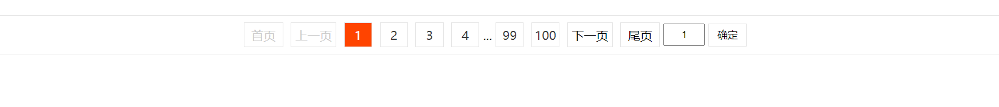
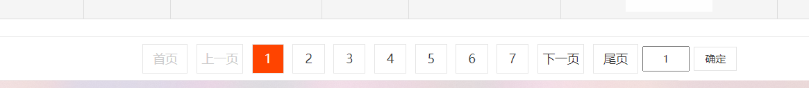

### 分页器

#### 使用

1. 引入样式文件`<link rel="stylesheet" href="./pagination.css">`

2. 引入js代码文件` <script src="./pagination.js"></script>`

3. js代码添加

   ```javascript
   // 使用
   let $pager = document.getElementById("pagination");
   let config = {
       page: {
           current: 2,
           total: 25
       },
       text: {
       }
   };
   function callback(page) {
       console.log(`当前页码为: ${page}`);
   }
   new Pagination($pager, config, callback);
   ```

#### 具体参数

Pagination(dom, config, callback)

1. dom: 分页器的承载容器
2. config: 参数配置
   - page
     - current: 当前页
     - total: 总页数
     - least: 当总页数低于least的时候页码全部显示
     - size: 一次显示多少页码
   - text: 设置显示文字
     - first: (默认: 首页)
     - prev: (默认: 上一页)
     - next: (默认: 下一页)
     - last: (默认: 尾页)
3. callback: 页码更新时的回调函数

#### 参考示例

```html
<!DOCTYPE html>
<html lang="zh">

<head>
    <meta charset="UTF-8">
    <meta http-equiv="X-UA-Compatible" content="IE=edge">
    <meta name="viewport" content="width=device-width, initial-scale=1.0">
    <title>分页器演示</title>
    <link rel="stylesheet" href="./pagination.css">
    <script src="./pagination.js"></script>
</head>

<body>
    <div id="pagination"></div>
    <script>
        // 使用
        let $pager = document.getElementById("pagination");
        let config = {
            page: {
                current: 2,
                total: 25
            },
            text: {
            }
        };
        function callback(page) {
            console.log(`当前页码为: ${page}`);
        }
        new Pagination($pager, config, callback);
    </script>
</body>

</html>
```

### 效果图
#### 图1

#### 图2

#### 图3

#### 图4

